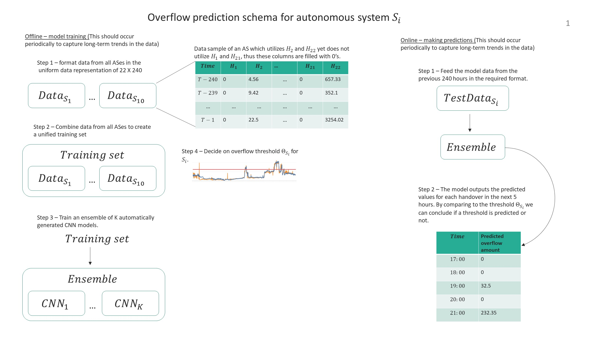

## Overflow Prediction: Algorithm for detecting overflows in internet traffic, using automatically generated convolutional neural networks


###Instructions to run the algorithm on the provided sample dataset, with pre-provided neural network architectures:


###Instructions to run the algorithm on your own dataset  
#### This process contains several phases:
#### 1. Split the data into K folds
1. The data format should be exactly the same as the provided sample data files in
EEGNAS/data/overflow_prediction. Each autonomous system's data should be in a single CSV files named
<AS_name>_<date_range>.csv.  
The columns of the CSV file are as so:  
   * ts - hourly timestamps in the format: dd:mm:yyyy hh:mm:ss
    * <AS_name> - traffic volumes for the private network interface
    * <handover_1> - traffic volumes for the first non-PNI handover
    * <handover_2> - traffic volumes for the second non-PNI handover
    * ...  
    A name for the dataset should be chosen, and then the files should be inserted in
  EEGNAS/data/<dataset_name>.

2. make sure that the entry `export_data_folder = ["../EEGNAS/data"]` appears in
overflow_prediction/netflow_config.ini, under the category `[overflow_prediction_kfold]`.  
The entry `autonomous_systems` should contain the following: `[["<AS_name_1>","<AS_name_2>",...]]`.  
The entry `handovers` should contain the following: `[["<AS_name_1>","<AS_name_2>",...,"<handover_name_1>","<handover_name_2>",...]]`.  
The entry `as_to_test` should contain the following: `["<AS_name_1>","<AS_name_2>",...]`.  
   
3. You can now run the script that splits the data into folds. Run `python prediction_experiment overflow_prediction_kfold`
and in the folder EEGNAS/data you should find `K` directories for the `K` folds created. Each directory will
contain the following files: `X_train.npy, X_test.npy, y_train.npy, y_test.npy`.
   
#### 2. Run The NAS algorithm to create K CNN ensembles for the K data folds.
1. In EEGNAS/configurations/config.ini, change the entry `dataset` under the category `[overflow_prediction_byfold]`
to contain the name of the folders that were created in the previous step. For example: `dataset = ["overflow_prediction_per_handover_fold_0","overflow_prediction_per_handover_fold_1",...]`
2. Run `python EEGNAS_experiment.py -e overflow_prediction_byfold`. This run can take several minutes up to several hours,
depending on the available hardware and on the size of the dataset.
3. After the run finishes you should have `K` new folders in results. Each folder contains the name of the dataset
and the fold it belongs to, for example `4_3_overflow_prediction_per_handover_fold_0`. Each such folder
contains a file ending with `architectures.p`. Copy each such `architectures` file into the folder
overflow_prediction/eegnas_models. Thus, overflow_prediction/eegnas_models should contain 10 new files with NN architectures,
one file for each fold of the data.  

#### 3. Run the overflow prediction experiment using NAS-generated CNN ensembles  
1. Run `python overflow_prediction/prediction_experiment.py overflow_prediction_kfold`
2. The results are stored in the most recent folder in overflow_prediction/prediction_results,
under the file name `all_classification_results.csv`.
* The provided sample data is randomly generated, thus the actual performance for this dataset is irrelevant.


### Citing
* If you use this code in a scientific publication, please cite us as:
```
@inproceedings{eegnas,
	title={EEGNAS : Neural Architecture Search for Electroencephalography Data Analysis and Decoding},
	author={Elad Rapaport, Oren Shriki, Rami Puzis},
	booktitle={Joint Workshop on Human Brain and Artificial Intelligence (HBAI)},
	year={2019},
	publisher={Springer}
}
```